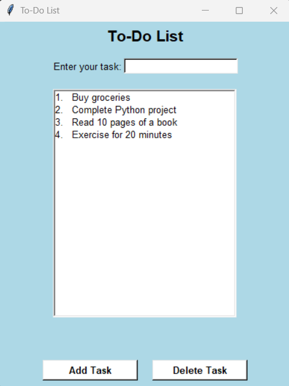

# ToDo-List-py
A simple To-Do List application built with Python and Tkinter that provides a user friendly GUI with a light blue theme. It allows users to add tasks with automatic numbering, delete selected tasks, and automatically re-number tasks after deletion. This beginner friendly project is perfect for practicing Python GUI development using Tkinter.

# To-Do List App
A simple To-Do List application built with Python and Tkinter.   
This app allows users to:  

- Add tasks with automatic numbering   
- Delete selected tasks   
- Automatically re-number tasks after deletion   
- User-friendly GUI with a light blue theme   

Perfect beginner-friendly project to practice Python GUI development with Tkinter.   

# How to Run  
1. Make sure you have Python installed.   
2. Save the code in a file named `ToDoListApp.py`.   
3. Run the file   
   
# Requirements
- Python 3.x 
- Tkinter (comes pre-installed with Python) 

# Screenshots of App

